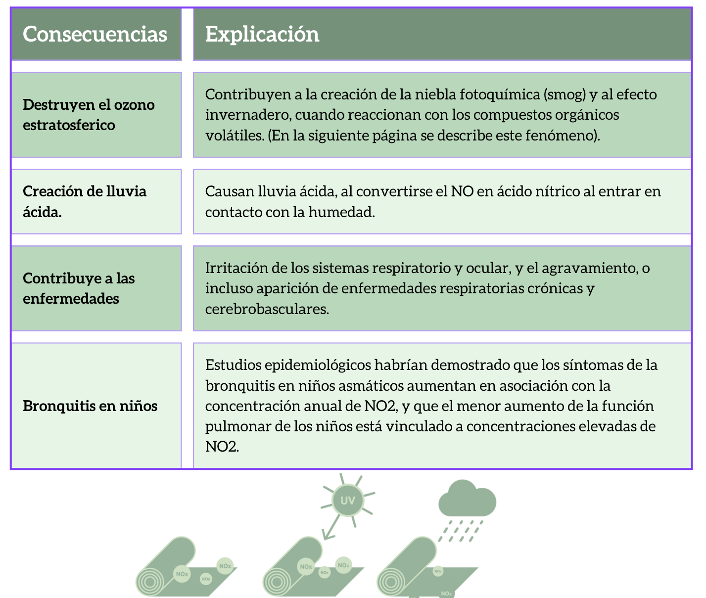
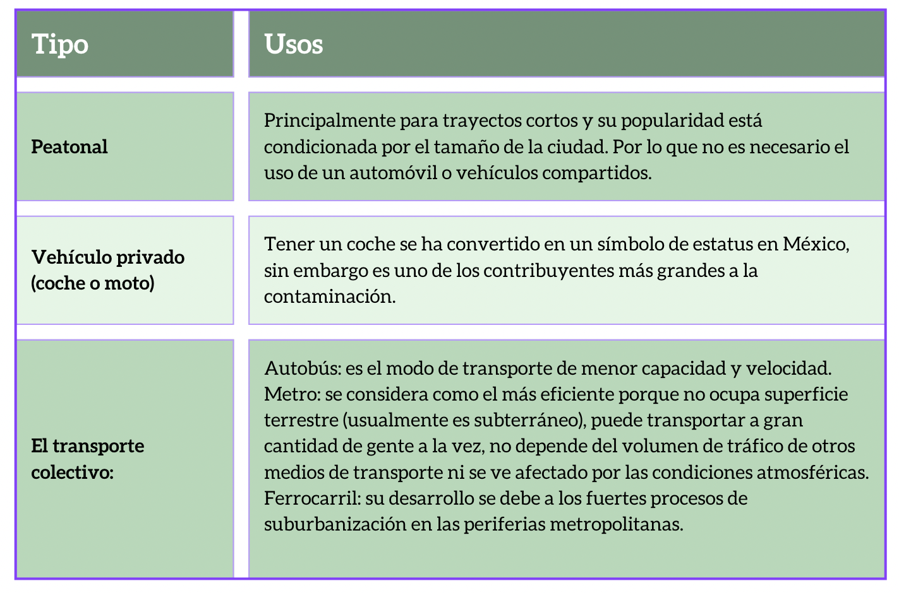

```{r setup, include=FALSE}
library(flexdashboard)
library(dygraphs)
library(leaflet)
library(plotly)
library(readr)
library(shiny)
library(randomForest)
library(iml)
set.seed(123)
```

```{r}
datos <- read_csv("datos.csv")
dia <- seq(as.Date("2020-01-01"), as.Date("2020-12-31"), by = "day")
ozono <- datos$O3
nox <- datos$NOX
Res<- datos$Residencial
trab <- datos$Trabajo
```
# En qué consiste la Propuesta 
La Ciencia de Datos es un área de estudio donde la estadística, las matemáticas y la programación se aprenden en conjunto. Se tuvieron tres sesiones de capacitación a manera de introducción a la carrera donde aprendimos tres esquemas generales de modelado de datos. Estos corresponden a una forma de organizar, clasificar e identificar datos de los modelos conocidos hasta el momento de  Machine Learning o Inteligencia Artificial . 

Es entonces que hablamos del aprendizaje del entrenamiento supervisado donde se conocen variables de salida que se quieren estimar para predecir resultados. Aquí vimos regresión. lineal y la clasificación de datos. Es aquí donde contemplamos la cantidad de los valores, su peso y como este impacta en el modelado de datos para brindar un resultado. 

Los temas visto hasta cierto punto fueron, Regresión Lineal, Clasificación y Clustering, y en base a ellos es que genero la siguiente propuesta: La Huella Que Dejamos. 
Donde voy a abordar el tema de el Medio Ambiente y como este se impacta la mala calidad del aire  y su relación con la movilidad urbana en la huella de carbono.

Por lo que los conocimientos que obtuve, más los conocimientos que ya tenía, plantearé una forma de resolverlo teniendo con una regresión lineal en R tomando en cuenta como valores, la calidad de aire y la movilidad durante el año 2020, donde comenzó la pandemia. 

**Bajo la siguiente hipótesis: A mayor cantidad de gente en su casa: menor cantidad de emisiones atmosféricas (especialmente NOX) y mayor cantidad de generación de O3 troposférico.**

Esto es lo que se va a contemplar para este proyecto: 

**NOX y Ozono** (adjunto imagen para ver las consecuencias del NOX)
<div>

</p>
</div>

**Movilidad urbana** (adjunto imagen para explicar los tipos)
Imagen de los tipos de movilidad
<div>

</p>
</div>


Y se tomará en cuenta para explicar la relación entre estos componentes con la **regresión lineal** que consiste en predecir por medio de definir variables, el valor de otra. La variable que está utilizando para predecir el valor de la otra variable se denomina variable independiente. Esta forma de análisis estima los coeficientes de la ecuación lineal, involucrando una o a más variables independientes que mejor predicen el valor de la variable dependiente.

# Datos de O3 y NOx

```{r}
datos <- data.frame(fecha = dia, ozono = ozono, nox = nox, residencial = Res, trabajo = trab )
```

## Column {data-width="650"}

### Ozono

```{r}
dygraph(datos[, c("fecha", "ozono")], main = "Niveles de Ozono") %>%
  dyRangeSelector()
```

## Column {data-width="350"}

### NOx

```{r}
dygraph(datos[, c("fecha", "nox")], main = "Niveles de NOx") %>%
  dyRangeSelector()
```

### Tabla de datos

```{r}
datos %>%
  knitr::kable()
```

# Reporte de movilidad
Este es un gráfico que muestra la permanencia de personas en su casa "residential"
Movilidad urbana: el conjunto de desplazamientos, tanto de personas como de mercancías, que se producen en una ciudad, bien sea en transporte público o privado." **Estos al momento de desplazarse con vehículos que usan combustibles fósiles para el motor, emiten gases que son perjudiciales a la calidad del aire.**
Aquí podemos ver que durante inicios de la pandemia la mayoría se quedó en sus casas y la movilidad laboral se redujo. 


## Column {data-width="650"}

```{r}
dygraph(datos[, c("fecha", "residencial")], main = "Movilidad residencial") %>%
  dyRangeSelector()
```

## Column {data-width="350"}

## Gente que se mueve a su trabajo

```{r}
dygraph(datos[, c("fecha", "trabajo")], main = "Movilidad laboral") %>%
  dyRangeSelector()
```


# Regresión lineal cont

```{r}
dato <- data.frame(ozono = ozono, nox = nox)

dato <- na.omit(dato)

dato[] <- lapply(dato, as.numeric)

```

```{r}
# Ajustar modelo de regresión lineal
fit <- lm(nox ~ ozono, data = dato)
```

## Column {data-width="650"}

Gráfica de regresión

```{r}
# Crear gráfica interactiva con plotly
ggplot(dato, aes(x = nox, y = ozono)) +
  geom_point() +
  geom_smooth(method = "lm", se = FALSE, color = "red")
```


La relación entre estos componentes es definitiva porque de estos se deriva algo llamado smog fotoquímico. Este fenómeno es algo que podemos ver en plena vista, porque se trata de una contaminación del aire, que se da cuando se combina niebla con humo y otras partículas contaminantes que flotan en la atmósfera, en zonas con niveles de contaminación elevada. Así, puede darse cuando hay niebla o bruma y el aspecto que tiene es que el ambiente está lleno de humo, normalmente de olor extraño y de colores que pueden ir desde el gris hasta el naranja o rojizo. Se genera a partir de la formación de ozono en las capas bajas de la atmósfera (lo que no es normal); este ozono se denomina ozono troposférico y es un contaminante secundario. Se forma a partir de una reacción con luz solar en presencia de NOx y compuestos orgánicos volátiles. Esta reacción es más frecuente en verano, ya que la luz del sol es el motor de la reacción fotoquímica. 
Hay varias causas que producen este fenómeno, las cuales son: 
Actividad industrial que emite humos con gases de efecto invernadero y otros contaminantes ambientales, tanto al aire como al suelo y al agua, ya que estos también terminan en el aire.
**Las emisiones de gases de los vehículos que usan combustibles fósiles.**
La mala gestión de residuos contaminantes tanto urbanos como en el medio rural.


## Column {data-width="350"}

Resumen del modelo

```{r}
summary(fit)
```

# Regresión lineal movilidad

```{r}
datos2 <- data.frame(ozono = ozono, nox = nox, residencial = Res )

datos2 <- na.omit(datos2) #borra las filas con datos faltantes

datos2[] <- lapply(datos2, as.numeric)

```

```{r}
# Ajustar modelo de regresión lineal
fit2 <- lm(ozono ~ residencial, data = datos2)
```

## Column {data-width="650"}

Gráfica de regresión

```{r}
# Crear gráfica interactiva con plotly
ggplot(datos2, aes(x = residencial, y = ozono)) +
  geom_point() +
  geom_smooth(method = "lm", se = FALSE, color = "red")
```


Este es un gráfico que muestra la permanencia de personas en su casa "residential"
Movilidad urbana: el conjunto de desplazamientos, tanto de personas como de mercancías, que se producen en una ciudad, bien sea en transporte público o privado." **Estos al momento de desplazarse con vehículos que usan combustibles fósiles para el motor, emiten gases que son perjudiciales a la calidad del aire.**
Aquí podemos ver que durante inicios de la pandemia la mayoría se quedó en sus casas y la movilidad laboral se redujo. 


## Column {data-width="350"}
Resumen del modelo
```{r}
summary(fit2)
```

# Estaciones

El **ozono** (O3) es una molécula compuesta por tres átomos de oxígeno. Es un gas incoloro e inestable que se encuentra en la atmósfera terrestre. A nivel del suelo, el ozono es considerado un contaminante peligroso para la salud humana y el medio ambiente.

Los **óxidos de nitrógeno** (NOx) son un grupo de gases compuestos por óxido nítrico (NO) y dióxido de nitrógeno (NO2). Estos gases son producidos principalmente por la combustión de combustibles fósiles en vehículos y plantas industriales. Los NOx son contaminantes peligrosos para la salud humana y el medio ambiente.

Ubicación de la estación de calidad del aire de la cual se tomaron los datos:

```{r}
# Coordenadas de las estaciones
# Coordenadas de las estaciones
estaciones <- data.frame(
  nombre = c("Las Aguilas", "Atemajac", "Centro", "Loma Dorada", "MIR", "OBL", "Tlaquepaque", "Vallarta", "Las Pintas", "Santa Fe"),
  lat = c(20.630983, 20.719626, 20.673844, 20.631665, 20.614511, 20.700501, 20.640941, 20.680141, 20.576708, 20.528954),
  long = c(-103.416735, -103.355412, -103.333243, -103.256809, -103.343352, -103.296648, -103.312497, -103.398572, -103.326533, -103.377180),
  ozono = c(0.02, 0.05, 0.05, 0.05, 0.05, 0.05, 0.05, 0.05, 0.05, 0.05)
)

# Crear mapa interactivo
m <- leaflet() %>%
  addTiles() %>%
  addMarkers(data = estaciones, ~long, ~lat,
             label = ~nombre,
             labelOptions = labelOptions(noHide = TRUE))
m
```


# Bosque


```{r}
datosrf <- read_csv("datos.csv")
#contaminantes estacion aguila
O3 <- datosrf$O3
NOx <- datosrf$NOX

#datos de movilidad 
RecreativosTiendas <- datosrf$RecreativosTiendas
AbarrotesFarmacias<- datosrf$AbarrotesFarmacias
Parques<- datosrf$Parques
EstacionesTransito<- datosrf$EstacionesTransito
Trabajo <- datosrf$Trabajo
Residencial<- datosrf$Residencial

datosrf <- data.frame(O3, NOx, RecreativosTiendas, AbarrotesFarmacias, Parques, EstacionesTransito, Trabajo,Residencial   )

datosrf <- na.omit(datosrf)

datosrf[] <- lapply(datosrf, as.numeric)

```

Como vimos en apartados anteriores, el uso de la regresión lineal nos dió una "buena idea" de la relación entre las variables de movilidad urbana y la concentración de contaminantes atmosféricos, el R2 del modedlo no es suficiente como para hacer predicciones, de forma que usaremos un algortimo clásico llamado "random forest" para poder hacer predicciones más precisas, este además puede usar multiples variables de entrada para hacer predicciones.

**Random Forest**

Bosque aleatorio Random Forest es un algoritmo de aprendizaje automático para clasificación y regresión que se basa en la construcción de múltiples árboles de decisión. Cada árbol se construye utilizando una muestra aleatoria con reemplazo de los datos de entrenamiento y una selección aleatoria de las variables predictoras en cada división del árbol. Luego, las predicciones se realizan tomando la media (en el caso de regresión) o la moda (en el caso de clasificación) de las predicciones individuales de cada árbol.

Este enfoque permite reducir la varianza y mejorar la precisión del modelo al promediar las predicciones de múltiples árboles. Además, Random Forest es capaz de manejar grandes conjuntos de datos con muchas variables predictoras y es relativamente robusto ante el ruido y los valores atípicos.

**Coeficiente de determinación**

El coeficiente de determinación R² es una medida estadística que indica cuánta variabilidad en una variable dependiente es explicada por un modelo. En el caso de un modelo de regresión de Random Forest, el R² se puede calcular comparando las predicciones del modelo con los valores observados.

Un valor de R² cercano a 1 indica que el modelo explica una gran parte de la variabilidad en los datos, mientras que un valor cercano a 0 indica que el modelo no explica bien la variabilidad en los datos. 

```{r}
# Modelo Random Forest
model <- randomForest(O3 ~ ., data = datosrf)
```

El coeficiente de determiación del modelo (R2) es: 

```{r}
#Evaluacion del modelo 
# Dividir el conjunto de datos en entrenamiento y prueba
set.seed(123) # para obtener resultados reproducibles
train_index <- sample(nrow(datosrf), 0.8 * nrow(iris))
train_data <- datosrf[train_index, ]
test_data <- datosrf[-train_index, ]

# Entrenar el modelo con el conjunto de entrenamiento
model <- randomForest(O3 ~ ., data = datosrf)

# Evaluar la precisión del modelo con el conjunto de prueba
prediction <- predict(model, newdata = test_data)
cor(prediction, test_data$O3)^2 # Coeficiente de determinación (R^2)

```


## Evaluando la importancia de cada variable del modelo


```{r}
# Modelo Random Forest
model <- randomForest(O3 ~ ., data = datosrf)

# Calcular la importancia relativa de las variables
importance <- importance(model)

plot_ly(x = rownames(importance), y = importance[, 1]) %>%
  add_bars() %>%
  layout(title = "Importancia relativa de las variables")
```

**Importanciia de las variables del modelo**

La función importance(model) en R calcula la importancia de las variables en un modelo de Random Forest utilizando dos medidas: %IncMSE y IncNodePurity (también conocido como GINI)1.

La medida %IncMSE se calcula permutando los valores de cada variable en los datos fuera de bolsa (OOB) para cada árbol. Luego se registra el error de predicción en la porción OOB de los datos (tasa de error para clasificación y MSE para regresión). Después se hace lo mismo después de permutar cada variable predictora2. Un aumento mayor en el MSE indica una mayor importancia de la variable

Aquí claramente podemos ver que las variables "EstacionesTransito" y "RecreativosTiebdas" son las que más importancia tienen para el modelo, una posible hipótesis al respecto es que las personas en la pandemía seguían moviéndose en transporte a comprar comida y bienes en tiendas, escenciales para supervivencia básica. 

El coeficeinte de determinación del modelo es: 

```{r}
cor(prediction, test_data$O3)^2 # Coeficiente de determinación (R^2)
```


## Column {data-width="650"}


```{r}
# Modelo Random Forest

# Entradas del usuario para las variables predictoras

# NOx
sliderInput("NOx", "NOx (PPM)",
            min = min(datosrf$NOx), max = max(datosrf$NOx),
            value = mean(datosrf$NOx))

# RecreativosTiendas
sliderInput("RecreativosTiendas", "RecreativosTiendas(%)",
            min = min(datosrf$RecreativosTiendas), max = max(datosrf$RecreativosTiendas),
            value = mean(datosrf$RecreativosTiendas))

# AbarrotesFarmacias"
sliderInput("AbarrotesFarmacias", "AbarrotesFarmacias(%)",
            min = min(datosrf$AbarrotesFarmacias), max = max(datosrf$AbarrotesFarmacias),
            value = mean(datosrf$AbarrotesFarmacias))

# Parques

sliderInput("Parques", "Parques (%)",
            min = min(datosrf$Parques), max = max(datosrf$Parques),
            value = mean(datosrf$Parques))

# EstacionesTransito
sliderInput("EstacionesTransito", "EstacionesTransito (%)",
            min = min(datosrf$EstacionesTransito), max = max(datosrf$EstacionesTransito),
            value = mean(datosrf$EstacionesTransito))


# Trabajo
sliderInput("Trabajo", "Trabajo (%)",
            min = min(datosrf$Trabajo), max = max(datosrf$Trabajo),
            value = mean(datosrf$Trabajo))

# Residencial
sliderInput("Residencial", "Residencial(%)",
            min = min(datosrf$Residencial), max = max(datosrf$Residencial),
            value = mean(datosrf$Residencial))


# Cálculo y visualización de la predicción
renderText({
  
  NOx <- input$NOx
  RecreativosTiendas <- input$RecreativosTiendas
  AbarrotesFarmacias <-  input$AbarrotesFarmacias
  Parques<-  input$Parques 
  EstacionesTransito <- input$EstacionesTransito
  Trabajo <- input$Trabajo
  Residencial <- input$Residencial
  
    new_data <- data.frame(NOx  = NOx, RecreativosTiendas  = RecreativosTiendas,     AbarrotesFarmacias = AbarrotesFarmacias, Parques = Parques, EstacionesTransito  = EstacionesTransito, Trabajo = Trabajo, Residencial = Residencial )


            
  prediction <- predict(model, newdata=new_data)
  
  paste0("Concentracion de Ozono: ", round(prediction, 5), " PPM")
})
```

Aquí podemos ver esta app interactiva que predice el nivel de Ozono troposférico en función de las variables de movilidad de Google Mobility reports y la concentración de NOx con datos de la etación "Aguilas"


